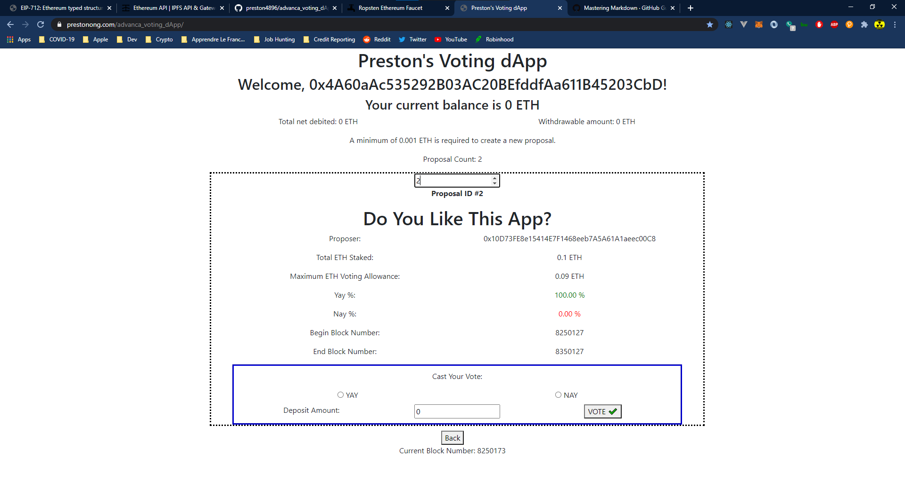

# Voting dApp by Preston Ong

## Description:
A very simple decentralized web application (dApp) for users to submit a proposal with binary options that can be voted with either a yay or nay option. Users who picked the majority vote by the end of a proposal can claim ETH and withdraw to their accounts. The app is now live and can be accessed [here.](https://prestonong.com/advanca_voting_dApp/)

## Available Networks:
The smart contract is currently deployed to the following Ethereum test networks:

- [Goerli](https://goerli.etherscan.io/address/0x3418f4f8a01f51750bc448ecd624ebb669d82672)
- [Rinkeby](https://rinkeby.etherscan.io/address/0xf719d42fb61654e81dd0a3dff4be18c5af1a9fbb)
- [Ropsten](https://ropsten.etherscan.io/address/0xf719d42fb61654e81dd0a3dff4be18c5af1a9fbb)

Note: Do not run the `$ truffle test` command on any of the above testnet, the test cases provided can only work on a local blockchain (i.e. Ganache).

## Project Structure:

```
.
├── README.md
├── index.html
├── package.json
├── secrets.json
├── src
│   ├── contracts
│   │   └── Vote.sol
│   ├── js
│   │   └── app.min.js
├── test
│   └── test_vote.test.js
└── truffle-config.js

```

## Components:

1. `secret.json`
    - All API keys and mnemonic phrases of this app is to be stored in this file **locally**.
    - An example json file looks like the following:
    ```
    {
        "mnemonic": <insert mnemonic seed phrase here>,
        "infuraApiKey" : <insert Infura API key here>,
        "etherscanApiKey" : <insert Etherscan API key here, for contract verification purpose>
    }
    ```
2. `Vote.sol`
    - The backend smart contract of this dApp, acts as an escrow when users submitted their proposals and/or votes. It also ensures that users with the winning votes would get their ETH funds withdrawn.

3. `app.min.js`
    - Minified JS code that renders the front-end DOM components by using the ReactJS framework.

4. `testVote.test.js`
    - Test cases for unit testing the smart contract to ensure all functions are working as expected.

5. `truffle-config.js`
    - Truffle configuration for compiling and deploying the smart contract.

6. `package.json`
    - Dependencies used in this project.

---
## Quick Demo On The Live App

1. Click [here](https://prestonong.com/advanca_voting_dApp/) to the app and make sure that you have MetaMask installed.

2. Connect your Metamask wallet to the app on the Rinkeby Network.

3. Click on "Search or Vote On Proposal(s)", then entered "2" in the input field. This would load the proposal with ID #2.

4. You should see something similar to the screenshot below:


5. Make sure that you have some ETH in your account when you vote, otherwise the transaction will fail. You can get some test ETH from the [faucet](https://faucet.rinkeby.io/).

6. Once you picked a vote and initiated a transaction, it should take up to 20-30 seconds to include your vote in the proposal.

---
## Instructions to use on your local machine

1. Clone this repository. `$ git clone https://github.com/preston4896/advanca_voting_dApp.git`

2. Install dependencies. `$ npm install`

3. Start the local blockchain by running Ganache, `$ ganache-cli -p 7545`

4. Available scripts:

    - `$ truffle compile` : Compiles the Solidity Code into EVM readable code.
    - `$ truffle migrate --network <option>` : Deploys the smart contract to a network given by `<option>`, the default value is `development`, which deploys the contract locally to Ganache.
    - `$ truffle test` : Unit test the smart contract. **Local network only**
    - `$ npm run compile` : Compiles the JSX code to JS code using Babel.
    - `$ npm run build` : Minifies the JS file to be used for production.
    - `$ npm run start` : Creates a server and starts the dApp locally.

## Known Issue(s):
1. Transaction has been consistently failing on the Goerli Testnet due to Out Of Gas error.

2. (Not necessarily an issue, more of a poor UX design) The loading screen would usually stay for about 20 seconds long, this is because it takes an average of 20 seconds to include a transaction into a new block. (Probably longer on Rospten, being a PoW network)

## Future Improvements

1. Better UI design with CSS.

2. Bonus features: Allowing users an alternative voting staking option by depositing their ERC20 tokens instead of ETHs.


Last Updated: March 17th, 2021.